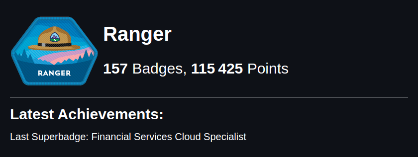

  

###

  
  
  
  
  
  
  
  
  
    
  
   
  <h1>  Howdy, I'm Abhishake Chandra! </h1>  

Glad to see you here! I'm a highly skilled and experienced Salesforce Consultant with over 14 years of success configuring, developing, testing, and implementing cutting-edge solutions for customer relationship management (CRM) systems like Siebel and Salesforce.

In my free time, I love to code and develop custom solutions for Salesforce applications. 

## 

  
### Languages and Tools
<table>
  <tr>
    <td>
      
  
   
  
   
  
   

    </td>
  </tr>
  <tr>
    <td>
  
        
      
   
  
   
  
   
  
  
    

    </td>
  </tr>
</table>

##

### Salesforce Technologies
<table>
  <tr>
    <td>

  
   
  
  
  
   
  
  
  
  

    </td>
  </tr>
</table>

##

### Github Stats
 

  
  
  
    
  

##

  
     
  

###

